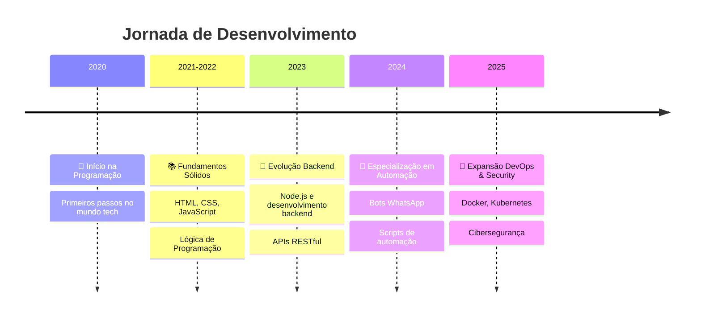

<div align="center">
  
<!-- Header com animação e design moderno -->


<h1 align="center">
  

<!-- ===== ESTATÍSTICAS & MÉTRICAS ===== -->
<div align="center">
  
</div>

<details open>
<summary><h2>📈 Estatísticas & Métricas</h2></summary>

<div align="center">
  
</div>

### 📊 Estatísticas Gerais

<div align="center">
  <table>
    <tr>
      <td align="center">
        
      </td>
      <td align="center">
        
      </td>
    </tr>
  </table>
</h1>

<div align="center">
  
  
  
</div>

<br>

<div align="center">
  <h3>🎯 <b>Desenvolvedor Full-Stack</b> | Node.js & JavaScript Specialist</h3>
  <p><b>🤖 Automação & Bots | 🐧 Linux Expert | 🔐 Cybersecurity & Pentest</b></p>
</div>

<div align="center">
  <a href="https://github.com/kaikygr" target="_blank">
    
  </a>
  <a href="https://www.linkedin.com/in/kaiky-gomes/" target="_blank">
    
  </a>
  <a href="mailto:kaikygomesribeiroof@gmail.com" target="_blank">
    
  </a>
  <a href="https://wa.me/5595991264582" target="_blank">
    
  </a>
</div>

<br>

<div align="center">
  
  
  
</div>

</div>

<!-- ===== SOBRE MIM ===== -->
<div align="center">
  
</div>

<details open>
<summary><h2>🧑‍💻 Sobre Mim</h2></summary>

<div align="center">
  <table>
    <tr>
      <td>
        
      </td>
      <td>
        <h3>🚀 Desenvolvedor Full-Stack Apaixonado</h3>
        <p align="left">
          Especialista em <b>Node.js</b> e <b>JavaScript</b> com foco em desenvolvimento de aplicações web completas e criação de <b>automações e bots</b> (incluindo WhatsApp).
          <br><br>
          Como usuário Linux dedicado 🐧 <i>("Linux forever!")</i>, possuo experiência prática em <b>Administração de Sistemas Linux</b> (Arch/Ubuntu). Sou entusiasta e estudante contínuo de <b>Cibersegurança</b> e <b>Testes de Penetração</b>.
        </p>
      </td>
    </tr>
  </table>
</div>

### 🎯 Status Atual

<div align="center">
  <table>
    <tr>
      <td align="center" width="200">
        
      </td>
      <td align="center" width="200">
        
      </td>
      <td align="center" width="200">
        
      </td>
    </tr>
  </table>
</div>

- 🌱 **Estudando:** Docker, React, Kubernetes, Segurança de APIs, DevOps e CI/CD
- 🔭 **Trabalhando em:** Projetos de automação e desenvolvimento de bots
- 🌍 **Idiomas:** Português (Nativo), Inglês (Intermediário)
- 💡 **Interesses:** Automação, Segurança da Informação, Open Source, IoT
- 🤝 **Disponível para:** Colaborações open-source, oportunidades profissionais

<div align="center">
  
</div>

</details>

<!-- ===== EXPERIÊNCIA & JORNADA ===== -->
<div align="center">
  
</div>

<details open>
<summary><h2>👨‍💼 Experiência & Jornada</h2></summary>

<div align="center">
  
</div>

### 🛤️ Timeline da Minha Jornada

<div align="center">
  


</div>

### 🎯 Especialidades Técnicas

<div align="center">
  <table>
    <tr>
      <td align="center" width="20%">
        
        <br><b>Backend Development</b>
        <br><sub>Node.js, Express.js, APIs RESTful</sub>
      </td>
      <td align="center" width="20%">
        
        <br><b>Automação</b>
        <br><sub>Bots WhatsApp, Scripts</sub>
      </td>
      <td align="center" width="20%">
        
        <br><b>Linux Administration</b>
        <br><sub>Arch Linux, Ubuntu, Scripting</sub>
      </td>
      <td align="center" width="20%">
        
        <br><b>Database Management</b>
        <br><sub>MongoDB, MySQL, SQLite, Redis</sub>
      </td>
      <td align="center" width="20%">
        
        <br><b>Security Testing</b>
        <br><sub>Burp Suite, Wireshark, Postman</sub>
      </td>
    </tr>
  </table>
</div>

</details>

<!-- ===== STACK TECNOLÓGICA ===== -->
<div align="center">
  
</div>

<details open>
<summary><h2>🛠️ Stack Tecnológica</h2></summary>

<div align="center">
  
</div>

### 💻 Linguagens & Frameworks

<div align="center">
  <table>
    <tr>
      <td align="center" width="25%">
        
        <br>JavaScript
      </td>
      <td align="center" width="25%">
        
        <br>TypeScript
      </td>
      <td align="center" width="25%">
        
        <br>Node.js
      </td>
      <td align="center" width="25%">
        
        <br>Python
      </td>
    </tr>
    <tr>
      <td align="center" width="25%">
        
        <br>React
      </td>
      <td align="center" width="25%">
        
        <br>Express.js
      </td>
      <td align="center" width="25%">
        
        <br>HTML5
      </td>
      <td align="center" width="25%">
        
        <br>CSS3
      </td>
    </tr>
  </table>
</div>

### 🗄️ Bancos de Dados & DevOps

<div align="center">
  <table>
    <tr>
      <td align="center" width="25%">
        
        <br>MongoDB
      </td>
      <td align="center" width="25%">
        
        <br>MySQL
      </td>
      <td align="center" width="25%">
        
        <br>Redis
      </td>
      <td align="center" width="25%">
        
        <br>SQLite
      </td>
    </tr>
    <tr>
      <td align="center" width="25%">
        
        <br>Docker
      </td>
      <td align="center" width="25%">
        
        <br>Git
      </td>
      <td align="center" width="25%">
        
        <br>Nginx
      </td>
      <td align="center" width="25%">
        
        <br>Kubernetes
      </td>
    </tr>
  </table>
</div>

### 🐧 Sistemas & Ferramentas

<div align="center">
  <table>
    <tr>
      <td align="center" width="25%">
        
        <br>Linux
      </td>
      <td align="center" width="25%">
        
        <br>Arch Linux
      </td>
      <td align="center" width="25%">
        
        <br>VS Code
      </td>
      <td align="center" width="25%">
        
        <br>Postman
      </td>
    </tr>
    <tr>
      <td align="center" width="25%">
        
        <br>Bash/Shell
      </td>
      <td align="center" width="25%">
        
        <br>Vim/Neovim
      </td>
      <td align="center" width="25%">
        
        <br>GitHub
      </td>
      <td align="center" width="25%">
        
        <br>Firebase
      </td>
    </tr>
  </table>
</div>

### 📊 Nível de Proficiência

<div align="center">
  
| Tecnologia | Nível | Experiência |
|------------|-------|-------------|
|  | ⭐⭐⭐⭐⭐ | 4+ anos |
|  | ⭐⭐⭐⭐⭐ | 3+ anos |
|  | ⭐⭐⭐⭐⭐ | 5+ anos |
|  | ⭐⭐⭐⭐ | 2+ anos |
|  | ⭐⭐⭐ | 1+ ano |
|  | ⭐⭐⭐ | Em aprendizado |

</div>

</details>

<!-- ===== OBJETIVOS PROFISSIONAIS ===== -->
<div align="center">
  
</div>

<details open>
<summary><h2>🎯 Objetivos Profissionais</h2></summary>

<div align="center">
  
</div>

<div align="center">
  <table>
    <tr>
      <td align="center" width="50%">
        
        <br><sub>Desenvolver soluções escaláveis com foco em automação e segurança</sub>
      </td>
      <td align="center" width="50%">
        
        <br><sub>Aprofundar conhecimentos em arquitetura de microsserviços e DevOps</sub>
      </td>
    </tr>
    <tr>
      <td align="center" width="50%">
        
        <br><sub>Contribuir ativamente para projetos open-source relevantes</sub>
      </td>
      <td align="center" width="50%">
        
        <br><sub>Expandir expertise em cibersegurança e ethical hacking</sub>
      </td>
    </tr>
  </table>
</div>

### 🎯 Metas 2025

- 🚀 Desenvolver soluções escaláveis com foco em **automação** e **segurança**
- 🏗️ Aprofundar conhecimentos em **arquitetura de microsserviços** e **DevOps**
- 🌟 Contribuir ativamente para projetos **open-source** relevantes
- 🔒 Expandir expertise em **cibersegurança** e **ethical hacking**
- 📚 Mentorar outros desenvolvedores iniciantes

</details>

---

## � Projeto em Destaque

### 📱 OmniZap System v1.0.5
**Sistema Profissional de Automação WhatsApp**

[](https://github.com/Kaikygr/omnizap-system)
[](https://github.com/Kaikygr/omnizap-system/blob/main/LICENSE)
[](https://nodejs.org/)

#### 📋 Visão Geral
O OmniZap System é uma solução robusta e escalável para automação de mensagens no WhatsApp, construída sobre a poderosa biblioteca Baileys. Ele oferece funcionalidades essenciais para gerenciar conexões, processar mensagens, lidar com grupos e monitorar o desempenho do sistema, ideal para empresas e desenvolvedores que buscam integrar o WhatsApp em seus fluxos de trabalho.

#### ✨ Funcionalidades Principais
- **Conexão Flexível**: Suporte para conexão via QR Code e Código de Pareamento para maior conveniência e segurança.
- **Gerenciamento de Sessão**: Persistência automática das credenciais de autenticação para reconexões rápidas e sem interrupções.
- **Processamento de Mensagens**: Lida com o recebimento e atualização de mensagens, incluindo suporte a enquetes.
- **Gerenciamento Avançado de Grupos**: Funções globais para acessar informações detalhadas de grupos e comando `/grupoinfo` para consulta direta.
- **Sistema de Logs Avançado**: Logs detalhados com rotação diária de arquivos e múltiplos níveis de log.
- **Monitoramento de Métricas**: Coleta e log de métricas de uso de CPU e memória do sistema.
- **Reconexão Automática**: Lógica de reconexão robusta com tentativas limitadas em caso de desconexões inesperadas.

#### 🛠️ Tecnologias Utilizadas
- **Node.js** (>=16.0.0)
- **Baileys** (`@whiskeysockets/baileys`)
- **Winston** e **Winston Daily Rotate File**
- **Dotenv** e **Envalid**
- **Chalk** e **Node-Cache**
- **Moment-Timezone** e **Qrcode-terminal**

#### ⚙️ Instalação
1. **Clonar o Repositório**:
   ```bash
   git clone https://github.com/Kaikygr/omnizap-system.git
   cd omnizap-system
   ```
2. **Instalar Dependências**:
   ```bash
   npm install
   ```
3. **Configurar Variáveis de Ambiente**:
   Crie um arquivo `.env` na raiz do projeto, copiando o conteúdo de `.env.example` e preenchendo as variáveis conforme suas necessidades.
4. **Criar o Diretório de Armazenamento**:
   ```bash
   mkdir -p ./temp
   ```

#### ▶️ Como Usar
Para iniciar o OmniZap System, utilize o script `start_socket.sh`. Este script oferece opções para iniciar uma nova sessão ou reconectar a uma sessão existente.

#### 🗺️ Roadmap (Planos Futuros)
- Expansão de Comandos do Bot
- Integração com Banco de Dados
- Interface de Usuário (Web UI)
- Suporte a Múltiplos Usuários/Instâncias
- Melhorias na Modularidade e Extensibilidade
- Testes Automatizados

#### 📄 Licença
Este projeto está licenciado sob a Licença MIT. Veja o arquivo [LICENSE](https://github.com/Kaikygr/omnizap-system/blob/main/LICENSE) para mais detalhes.


