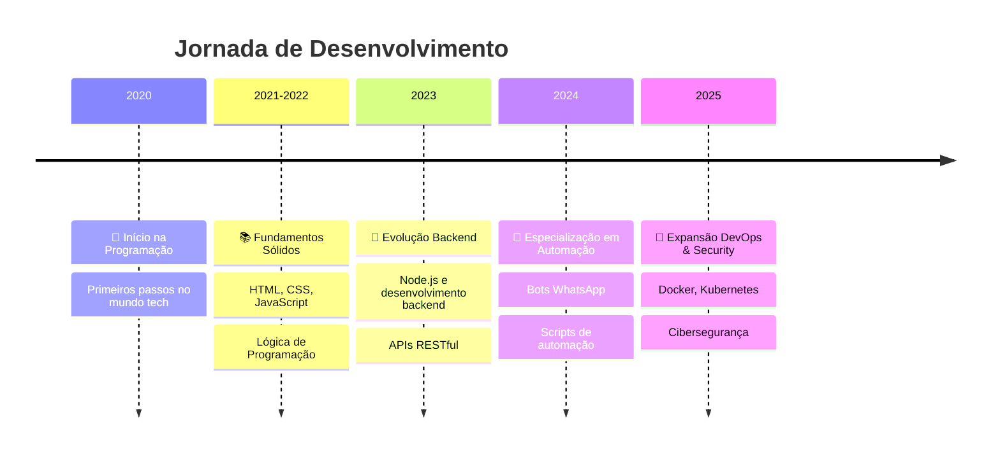

<div align="center">
  
<!-- Header com animação e design moderno -->


<h1 align="center">
  
<div align="center">
  
</div>

<details open>
<summary><h2>📈 Estatísticas & Métricas</h2></summary>

<div align="center">
  
</div>

### 📊 Estatísticas Gerais

<div align="center">
  <table>
    <tr>
      <td align="center">
        
      </td>
      <td align="center">
        
      </td>
    </tr>
  </table>
</h1>

<div align="center">
  
  
  
</div>

<br>

<div align="center">
  <h3>🎯 <b>Desenvolvedor Full-Stack</b> | Node.js & JavaScript Specialist</h3>
  <p><b>🤖 Automação & Bots | 🐧 Linux Expert | 🔐 Cybersecurity & Pentest</b></p>
</div>

<div align="center">
  <a href="https://github.com/kaikygr" target="_blank">
    
  </a>
  <a href="https://www.linkedin.com/in/kaiky-gomes/" target="_blank">
    
  </a>
  <a href="mailto:kaikygomesribeiroof@gmail.com" target="_blank">
    
  </a>
  <a href="https://wa.me/5595991264582" target="_blank">
    
  </a>
</div>

<br>

<div align="center">
  
  
  
</div>

</div>

<!-- ===== SOBRE MIM ===== -->
<div align="center">
  
</div>

<details open>
<summary><h2>🧑‍💻 Sobre Mim</h2></summary>

<div align="center">
  <table>
    <tr>
      <td>
        
      </td>
      <td>
        <h3>🚀 Desenvolvedor Full-Stack Apaixonado</h3>
        <p align="left">
          Especialista em <b>Node.js</b> e <b>JavaScript</b> com foco em desenvolvimento de aplicações web completas e criação de <b>automações e bots</b> (incluindo WhatsApp).
          <br><br>
          Como usuário Linux dedicado 🐧 <i>("Linux forever!")</i>, possuo experiência prática em <b>Administração de Sistemas Linux</b> (Arch/Ubuntu). Sou entusiasta e estudante contínuo de <b>Cibersegurança</b> e <b>Testes de Penetração</b>.
        </p>
      </td>
    </tr>
  </table>
</div>

### 🎯 Status Atual

<div align="center">
  <table>
    <tr>
      <td align="center" width="200">
        
      </td>
      <td align="center" width="200">
        
      </td>
      <td align="center" width="200">
        
      </td>
    </tr>
  </table>
</div>

- 🌱 **Estudando:** Docker, React, Kubernetes, Segurança de APIs, DevOps e CI/CD
- 🔭 **Trabalhando em:** Projetos de automação e desenvolvimento de bots
- 🌍 **Idiomas:** Português (Nativo), Inglês (Intermediário)
- 💡 **Interesses:** Automação, Segurança da Informação, Open Source, IoT
- 🤝 **Disponível para:** Colaborações open-source, oportunidades profissionais

<div align="center">
  
</div>

</details>

<!-- ===== EXPERIÊNCIA & JORNADA ===== -->
<div align="center">
  
</div>

<details open>
<summary><h2>👨‍💼 Experiência & Jornada</h2></summary>

<div align="center">
  
</div>

### 🛤️ Timeline da Minha Jornada

<div align="center">
  


</div>

### 🎯 Especialidades Técnicas

<div align="center">
  <table>
    <tr>
      <td align="center" width="20%">
        
        <br><b>Backend Development</b>
        <br><sub>Node.js, Express.js, APIs RESTful</sub>
      </td>
      <td align="center" width="20%">
        
        <br><b>Automação</b>
        <br><sub>Bots WhatsApp, Scripts</sub>
      </td>
      <td align="center" width="20%">
        
        <br><b>Linux Administration</b>
        <br><sub>Arch Linux, Ubuntu, Scripting</sub>
      </td>
      <td align="center" width="20%">
        
        <br><b>Database Management</b>
        <br><sub>MongoDB, MySQL, SQLite, Redis</sub>
      </td>
      <td align="center" width="20%">
        
        <br><b>Security Testing</b>
        <br><sub>Burp Suite, Wireshark, Postman</sub>
      </td>
    </tr>
  </table>
</div>

</details>

<!-- ===== STACK TECNOLÓGICA ===== -->
<div align="center">
  
</div>

<details open>
<summary><h2>🛠️ Stack Tecnológica</h2></summary>

<div align="center">
  
</div>

### 💻 Linguagens & Frameworks

<div align="center">
  <table>
    <tr>
      <td align="center" width="25%">
        
        <br>JavaScript
      </td>
      <td align="center" width="25%">
        
        <br>TypeScript
      </td>
      <td align="center" width="25%">
        
        <br>Node.js
      </td>
      <td align="center" width="25%">
        
        <br>Python
      </td>
    </tr>
    <tr>
      <td align="center" width="25%">
        
        <br>React
      </td>
      <td align="center" width="25%">
        
        <br>Express.js
      </td>
      <td align="center" width="25%">
        
        <br>HTML5
      </td>
      <td align="center" width="25%">
        
        <br>CSS3
      </td>
    </tr>
  </table>
</div>

### 🗄️ Bancos de Dados & DevOps

<div align="center">
  <table>
    <tr>
      <td align="center" width="25%">
        
        <br>MongoDB
      </td>
      <td align="center" width="25%">
        
        <br>MySQL
      </td>
      <td align="center" width="25%">
        
        <br>Redis
      </td>
      <td align="center" width="25%">
        
        <br>SQLite
      </td>
    </tr>
    <tr>
      <td align="center" width="25%">
        
        <br>Docker
      </td>
      <td align="center" width="25%">
        
        <br>Git
      </td>
      <td align="center" width="25%">
        
        <br>Nginx
      </td>
      <td align="center" width="25%">
        
        <br>Kubernetes
      </td>
    </tr>
  </table>
</div>

### 🐧 Sistemas & Ferramentas

<div align="center">
  <table>
    <tr>
      <td align="center" width="25%">
        
        <br>Linux
      </td>
      <td align="center" width="25%">
        
        <br>Arch Linux
      </td>
      <td align="center" width="25%">
        
        <br>VS Code
      </td>
      <td align="center" width="25%">
        
        <br>Postman
      </td>
    </tr>
    <tr>
      <td align="center" width="25%">
        
        <br>Bash/Shell
      </td>
      <td align="center" width="25%">
        
        <br>Vim/Neovim
      </td>
      <td align="center" width="25%">
        
        <br>GitHub
      </td>
      <td align="center" width="25%">
        
        <br>Firebase
      </td>
    </tr>
  </table>
</div>

### 📊 Nível de Proficiência

<div align="center">
  
| Tecnologia | Nível | Experiência |
|------------|-------|-------------|
|  | ⭐⭐⭐⭐⭐ | 4+ anos |
|  | ⭐⭐⭐⭐⭐ | 3+ anos |
|  | ⭐⭐⭐⭐⭐ | 5+ anos |
|  | ⭐⭐⭐⭐ | 2+ anos |
|  | ⭐⭐⭐ | 1+ ano |
|  | ⭐⭐⭐ | Em aprendizado |

</div>

</details>

<!-- ===== OBJETIVOS PROFISSIONAIS ===== -->
<div align="center">
  
</div>

<details open>
<summary><h2>🎯 Objetivos Profissionais</h2></summary>

<div align="center">
  
</div>

<div align="center">
  <table>
    <tr>
      <td align="center" width="50%">
        
        <br><sub>Desenvolver soluções escaláveis com foco em automação e segurança</sub>
      </td>
      <td align="center" width="50%">
        
        <br><sub>Aprofundar conhecimentos em arquitetura de microsserviços e DevOps</sub>
      </td>
    </tr>
    <tr>
      <td align="center" width="50%">
        
        <br><sub>Contribuir ativamente para projetos open-source relevantes</sub>
      </td>
      <td align="center" width="50%">
        
        <br><sub>Expandir expertise em cibersegurança e ethical hacking</sub>
      </td>
    </tr>
  </table>
</div>

### 🎯 Metas 2025

- 🚀 Desenvolver soluções escaláveis com foco em **automação** e **segurança**
- 🏗️ Aprofundar conhecimentos em **arquitetura de microsserviços** e **DevOps**
- 🌟 Contribuir ativamente para projetos **open-source** relevantes
- 🔒 Expandir expertise em **cibersegurança** e **ethical hacking**
- 📚 Mentorar outros desenvolvedores iniciantes

</details>

---

## � Projeto em Destaque

### 📱 OmniZap System v1.0.4
**Sistema Profissional de Automação WhatsApp**

[](https://github.com/Kaikygr/omnizap-system)
[](https://github.com/Kaikygr/omnizap-system/blob/main/LICENSE)
[](https://nodejs.org/)

#### 📋 Sobre o Projeto
Sistema robusto e profissional para automação de mensagens WhatsApp, desenvolvido com tecnologia **Baileys** para máxima compatibilidade e estabilidade. Apresenta **arquitetura modular avançada**, **sistema de cache inteligente** e **processamento de eventos independente** para performance e escalabilidade superiores.

#### ✨ Principais Características
- 🏗️ **Arquitetura Modular**: Sistema dividido em módulos independentes para máxima manutenibilidade
- 📊 **Sistema de Logging Centralizado**: Logging avançado com Winston, rotação automática e compressão
- 💾 **Cache Inteligente**: Sistema de cache com TTL configurável para otimização de performance
- 🎯 **Processamento de Eventos**: Handler independente para todos os eventos WhatsApp
- 🤖 **Sistema de Comandos**: Processamento inteligente com prefixos configuráveis
- 🔄 **Reconexão Automática**: Sistema inteligente de reconexão e tratamento de erros
- ⚡ **Alta Performance**: Processamento assíncrono e otimizações avançadas

#### 🛠️ Stack Tecnológica
```javascript
// Principais tecnologias utilizadas
const technologies = {
  backend: ["Node.js", "Baileys API", "Winston Logger"],
  cache: ["Node-Cache", "TTL Management"],
  utilities: ["Moment.js", "Chalk", "QR Code Terminal"],
  architecture: ["Modular Design", "Event-Driven", "Async Processing"]
};
```

#### 🏗️ Arquitetura do Sistema
- **Socket Controller**: Gerenciamento de conexão WhatsApp
- **Event Handler**: Processamento independente de eventos
- **Cache Manager**: Sistema de cache inteligente com estatísticas
- **Message Controller**: Lógica de negócios e processamento de comandos
- **Logger Module**: Sistema centralizado de logging

#### 📈 Métricas de Performance
- ⚡ **Processamento Assíncrono**: Eventos não-bloqueantes
- 📊 **Cache Hit/Miss Tracking**: Estatísticas detalhadas
- 🔄 **Event Batching**: Processamento em lote otimizado
- 💾 **Memory Management**: Limpeza automática de cache

#### 🎯 Funcionalidades Implementadas
- Sistema de comandos com switch/case otimizado
- Cache de mensagens, eventos, grupos e contatos
- Logs separados por tipo (aplicação, erro, aviso)
- Rotação automática de arquivos de log
- Suporte a múltiplos tipos de mídia
- Reconexão automática inteligente

<div align="center">

**[📖 Ver Documentação Completa](https://github.com/Kaikygr/omnizap-system)** | **[🚀 Começar Agora](https://github.com/Kaikygr/omnizap-system#-instalação)**

</div>

---

## �📈 Estatísticas & Métricas

<div align="center">
  
</div>

### 🔥 Streak & Atividade

<div align="center">
  
</div>

<div align="center">
  
</div>

### 🏆 Conquistas & Reconhecimentos

<div align="center">
  
</div>

<div align="center">
  <table>
    <tr>
      <td align="center">
        
      </td>
      <td align="center">
        
      </td>
    </tr>
  </table>
</div>

### 📊 Métricas de Performance 2025

<div align="center">
  <table>
    <tr>
      <th>Categoria</th>
      <th>Atual</th>
      <th>Meta 2025</th>
      <th>Progresso</th>
    </tr>
    <tr>
      <td>📝 Commits Anuais</td>
      <td>650+</td>
      <td>1000+</td>
      <td>
        <div align="center">
          
        </div>
      </td>
    </tr>
    <tr>
      <td>📚 Repositórios</td>
      <td>13</td>
      <td>20+</td>
      <td>
        <div align="center">
          
        </div>
      </td>
    </tr>
    <tr>
      <td>⭐ Stars Totais</td>
      <td>23</td>
      <td>50+</td>
      <td>
        <div align="center">
          
        </div>
      </td>
    </tr>
    <tr>
      <td>👥 Seguidores</td>
      <td>4</td>
      <td>25+</td>
      <td>
        <div align="center">
          
        </div>
      </td>
    </tr>
  </table>
</div>

### 📈 Contribuições Detalhadas

<div align="center">
  
</div>

<div align="center">
  <table>
    <tr>
      <td align="center">
        
      </td>
      <td align="center">
        
      </td>
    </tr>
    <tr>
      <td align="center">
        
      </td>
      <td align="center">
        
      </td>
    </tr>
  </table>
</div>

</details>

<!-- ===== VAMOS CONVERSAR ===== -->
<div align="center">
  
</div>

<details open>
<summary><h2>📫 Vamos Conversar!</h2></summary>

<div align="center">
  
</div>

<div align="center">
  <h3>🤝 Estou sempre aberto a <b>novas conexões</b>, <b>colaborações</b> e <b>oportunidades</b>!</h3>
</div>

### 📱 Conecte-se Comigo

<div align="center">
  <table>
    <tr>
      <td align="center" width="25%">
        <a href="mailto:kaikygomesribeiroof@gmail.com" target="_blank">
          
          <br><sub>Contato Profissional</sub>
        </a>
      </td>
      <td align="center" width="25%">
        <a href="https://www.linkedin.com/in/kaiky-gomes/" target="_blank">
          
          <br><sub>Networking Profissional</sub>
        </a>
      </td>
      <td align="center" width="25%">
        <a href="https://wa.me/5595991264582" target="_blank">
          
          <br><sub>Contato Rápido</sub>
        </a>
      </td>
      <td align="center" width="25%">
        <a href="https://t.me/kaikygr" target="_blank">
          
          <br><sub>Chat Direto</sub>
        </a>
      </td>
    </tr>
    <tr>
      <td align="center" width="25%">
        <a href="https://github.com/kaikygr" target="_blank">
          
          <br><sub>Projetos & Código</sub>
        </a>
      </td>
      <td align="center" width="25%">
        <a href="https://www.instagram.com/kaikygr/" target="_blank">
          
          <br><sub>Conteúdo Pessoal</sub>
        </a>
      </td>
      <td align="center" width="25%">
        <a href="#" target="_blank">
          
          <br><sub>Comunidades</sub>
        </a>
      </td>
      <td align="center" width="25%">
        <a href="#" target="_blank">
          
          <br><sub>Atualizações Tech</sub>
        </a>
      </td>
    </tr>
  </table>
</div>

### 💼 Oportunidades & Colaborações

<div align="center">
  <table>
    <tr>
      <td align="center" width="33%">
        
        <br><b>🚀 Freelance & Projetos</b>
        <br><sub>Desenvolvimento de automações, bots WhatsApp, APIs e sistemas web</sub>
      </td>
      <td align="center" width="33%">
        
        <br><b>🤝 Colaborações Open Source</b>
        <br><sub>Contribuições em projetos Node.js, automação e ferramentas Linux</sub>
      </td>
      <td align="center" width="33%">
        
        <br><b>📚 Mentoria & Ensino</b>
        <br><sub>Orientação em desenvolvimento full-stack e tecnologias modernas</sub>
      </td>
    </tr>
  </table>
</div>

### 🎯 O que Posso Oferecer

- 💻 **Desenvolvimento Full-Stack** com Node.js e JavaScript
- 🤖 **Automação e Bots** para WhatsApp e outras plataformas
- 🐧 **Administração de Sistemas Linux** e DevOps
- 🔐 **Consultoria em Segurança** e testes de penetração
- 📊 **Arquitetura de Software** modular e escalável

### � Entre em Contato

<div align="center">
  <a href="mailto:kaikygomesribeiroof@gmail.com?subject=Oportunidade%20de%20Colaboração&body=Olá%20Kaiky,%0A%0AGostaríamos%20de%20conversar%20sobre%20uma%20oportunidade...">
    
  </a>
  <br><br>
  <sub><i>💡 Respondo em até 24 horas!</i></sub>
</div>

</details>

<!-- ===== FOOTER ===== -->
<div align="center">
  
</div>

<div align="center">
  
</div>

<div align="center">
  <h3>⭐ Se você gostou do meu perfil, deixe uma estrela nos meus repositórios! ⭐</h3>
  <p><i>"A melhor forma de prever o futuro é criá-lo." - Peter Drucker</i></p>
  
  
  <br><br>
  
  
</div>


