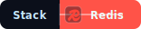
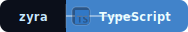
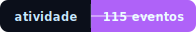
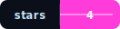
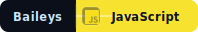
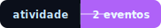
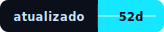

  

  

  
  

  
  

  
  
  

  
  
  

  

## Sobre

<!--ABOUT_AI_START-->
Kaiky Brito é um desenvolvedor focado no ecossistema JavaScript e TypeScript, com experiência na construção de aplicações utilizando Node.js, Express e integração com bancos de dados. Seu portfólio compreende dezesseis repositórios públicos, destacando-se o desenvolvimento de sistemas de monitoramento e automação como os projetos Zyra e News Anime Monitor. A trajetória do profissional evidencia uma base técnica sólida voltada para a escalabilidade de software e a exploração de linguagens de alto desempenho como Rust.

> _Atualizado em 18 de mai. de 2026, 21:29 (UTC)._
<!--ABOUT_AI_END-->

## Foco Atual

<!--FOCUS_DYNAMIC_START-->
- Manutenção de automações para sincronização de métricas e atualização de assets SVG.
- Desenvolvimento de sistemas de antiban, gestão de sessões e comandos de mídia no projeto Zyra.
- Otimização de pipelines de extração de dados e integração de IA no monitor de notícias.

> _Atualizado em 18 de mai. de 2026, 21:29 (UTC)._
<!--FOCUS_DYNAMIC_END-->

  

## Stack Principal

<!--STACK_DYNAMIC_START-->

  
  
  
  
  
  
  
  
  
  
  
  
  
  

Stack dinâmica baseada nas tecnologias detectadas nos repositórios.

<!--STACK_DYNAMIC_END-->

  

## Projetos em Destaque

Classificados automaticamente com base na atividade recente no GitHub.

<!--FEATURED_PROJECTS_START-->
### Projeto 1: [kaikybrofc](https://github.com/kaikybrofc/kaikybrofc)

**Descrição:** Profile repository with projects, background, and technical highlights.

   

  

### Projeto 2: [zyra](https://github.com/kaikybrofc/zyra)

**Descrição:** High-performance WhatsApp automation platform built with TypeScript, Baileys, MySQL, and Redis.

   

  

### Projeto 3: [news-anime-monitor](https://github.com/kaikybrofc/news-anime-monitor)

**Descrição:** Anime news monitoring platform with REST API, intelligent pipeline, and Next.js frontend.

   

  

### Projeto 4: [logger-module](https://github.com/kaikybrofc/logger-module)

**Descrição:** Production-grade TypeScript logging library for Node.js with redaction, tracing, and observability.

   

  

### Projeto 5: [Baileys](https://github.com/kaikybrofc/Baileys)

**Descrição:** Fork of Baileys: TypeScript/JavaScript WhatsApp Web API implementation.

   

  

### Projeto 6: [senpai-api](https://github.com/kaikybrofc/senpai-api)

**Descrição:** Fork of Senpai API with custom adaptations and experiments.

   
<!--FEATURED_PROJECTS_END-->

## Estatísticas Avançadas

<!--ADV_STATS_DYNAMIC_START-->
### Evolucao Mensal

  

### Ritmo Semanal

  

### Horarios de Pico

  

### Saude dos Repositorios

  

### Top Tecnologias

  

### Entrega e Manutencao

  

### Issues e PRs

  

### Velocidade de Merge

  

### Distribuicao de Projetos

  

### Marcos Recentes

<!--ADV_STATS_DYNAMIC_END-->

  

<!--ORGS_DYNAMIC_START-->
_Sem organizações vinculadas no momento._

> _Atualizado em 18 de mai. de 2026, 22:29 (UTC) | Fonte: GitHub API._
<!--ORGS_DYNAMIC_END-->
