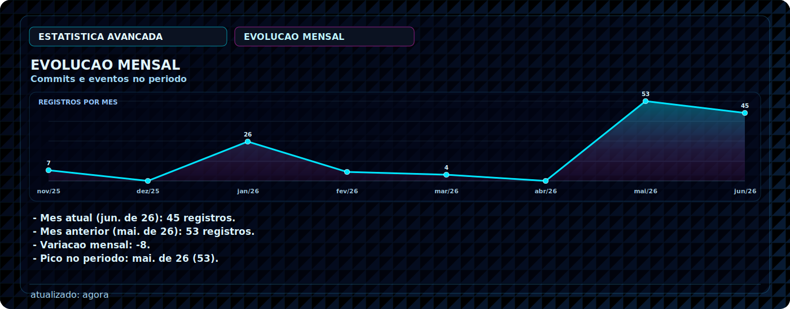
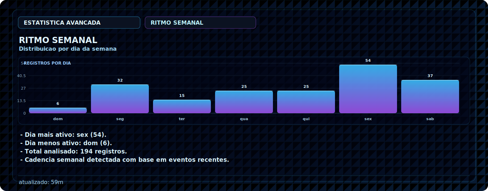
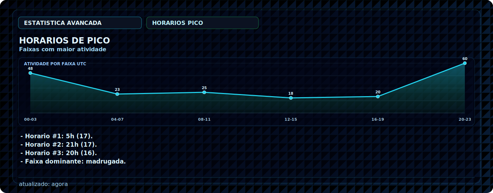
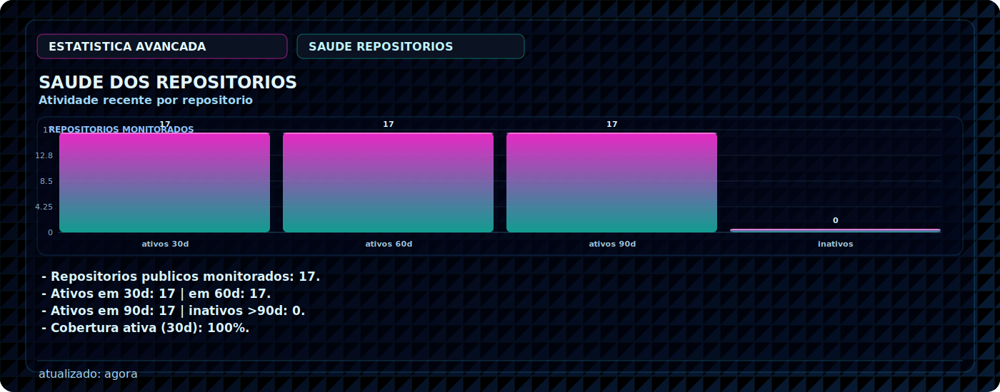
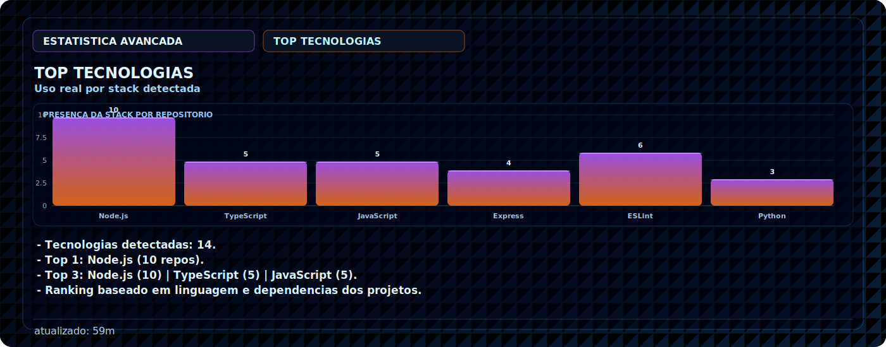
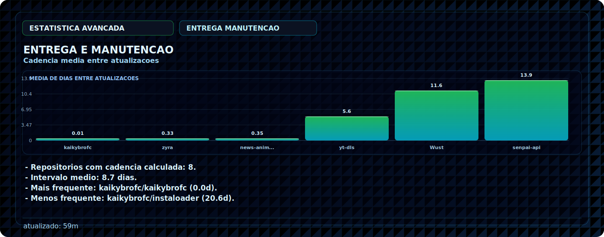
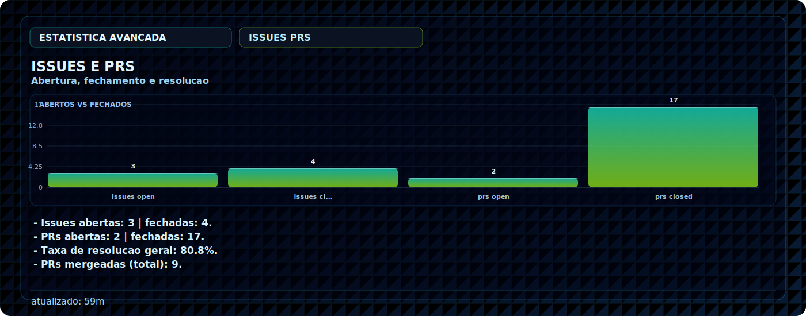
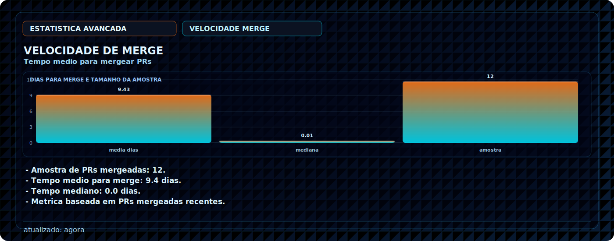
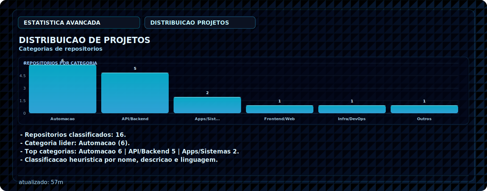
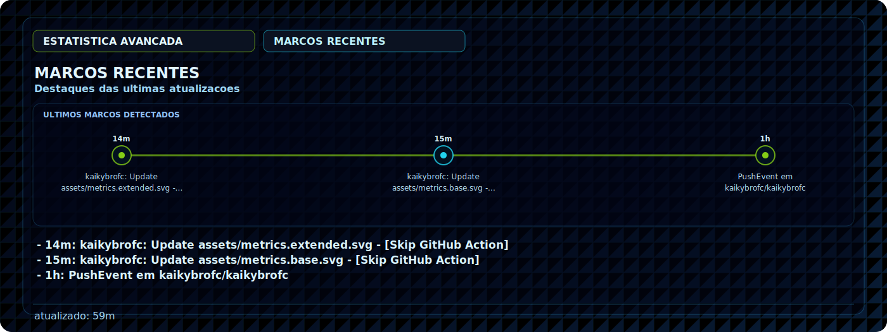

  

  

  <a href="https://github.com/kaikybrofc"></a>
  <a href="https://www.linkedin.com/in/kaiky-gomes/"></a>

  <a href="mailto:kaikygomesribeiroof@gmail.com"></a>
  <a href="https://wa.me/5595991122954"></a>

  
  
  

  
  
  

  

## Sobre

<!--ABOUT_AI_START-->
Kaiky Brito é um desenvolvedor de software focado em tecnologias web, com experiência consolidada em dezessete repositórios públicos e colaborações na organização Omnizap System. Sua especialidade técnica abrange o ecossistema Node.js, utilizando predominantemente JavaScript, TypeScript e Express para o desenvolvimento de aplicações integradas a bancos de dados como MySQL. Atualmente, destaca-se pela manutenção de projetos de automação e módulos utilitários, demonstrando versatilidade e compromisso com a entrega de soluções tecnológicas eficientes.

> _Atualizado em 25 de mar. de 2026, 18:30 (UTC)._
<!--ABOUT_AI_END-->

## Foco Atual

<!--FOCUS_DYNAMIC_START-->
- Manutenção de automações para atualização de métricas de perfil em SVG.
- Implementação de SEO e migração para Gemini CLI no News Anime Monitor.
- Otimização de fluxos de streaming local e metadados no Ayana Bot.

> _Atualizado em 25 de mar. de 2026, 18:30 (UTC)._
<!--FOCUS_DYNAMIC_END-->

  

## Stack Principal

<!--STACK_DYNAMIC_START-->

  
  
  
  
  
  
  
  
  
  
  
  
  
  

Stack dinâmica baseada nas tecnologias detectadas nos repositórios.

<!--STACK_DYNAMIC_END-->

  

## Organizações

<!--ORGS_DYNAMIC_START-->
| Organização | Repositórios Públicos | Seguidores | Repos em Destaque |
|---|---:|---:|---|
| [Omnizap System](https://github.com/Omnizap-System) @Omnizap-System | 2 | 1 | [omnizap](https://github.com/Omnizap-System/omnizap), [.github](https://github.com/Omnizap-System/.github) |

> _Atualizado em 25 de mar. de 2026, 18:30 (UTC) | Fonte: gh + API._
<!--ORGS_DYNAMIC_END-->

  

## Projetos em Destaque

Classificados automaticamente com base na atividade recente no GitHub.

<!--FEATURED_PROJECTS_START-->
### Projeto 1: [kaikybrofc](https://github.com/kaikybrofc/kaikybrofc)

**Descrição:** ✨ Aqui você encontra informações sobre mim.

   

  

### Projeto 2: [logger-module](https://github.com/kaikybrofc/logger-module)

**Descrição:** Módulo de log moderno em TypeScript usando Winston e Rotação de Arquivos.

   

  

### Projeto 3: [ayana-bot](https://github.com/kaikybrofc/ayana-bot)

**Descrição:** 🤖 Ayana System é um bot inteligente com temática anime, focado em automação, interações avançadas, jogos e recursos modernos para servidores. Rápido, elegan...

   

  

### Projeto 4: [news-anime-monitor](https://github.com/kaikybrofc/news-anime-monitor)

**Descrição:** Este projeto realiza o monitoramento automático da página de notícias de animes

   

  

### Projeto 5: [jsontree](https://github.com/kaikybrofc/jsontree)

**Descrição:** Visualize JSON data format as a tree or graph

   

  

### Projeto 6: [yt-dls](https://github.com/kaikybrofc/yt-dls)

**Descrição:** yt-dls é uma API simples e leve para download de vídeos do YouTube, construída em Node.js com o framework Express, que utiliza internamente a ferramenta yt-d...

   
<!--FEATURED_PROJECTS_END-->

## Estatísticas Avançadas

<!--ADV_STATS_DYNAMIC_START-->
### Evolucao Mensal



  

### Ritmo Semanal



  

### Horarios de Pico



  

### Saude dos Repositorios



  

### Top Tecnologias



  

### Entrega e Manutencao



  

### Issues e PRs



  

### Velocidade de Merge



  

### Distribuicao de Projetos



  

### Marcos Recentes


<!--ADV_STATS_DYNAMIC_END-->

  

