<div align="center">

# 👋 Olá! Eu sou Kaiky Gomes

📍 **Boa Vista, Roraima, Brasil** 🇧🇷 | 🚀 **Desenvolvendo desde 2020**

**Desenvolvedor Full-Stack** especializado em **Node.js & JavaScript**  
🤖 Automação e Bots | 🐧 Linux Enthusiast | 🔐 Cybersecurity & Pentest

[](https://github.com/kaikygr)
[](https://github.com/kaikygr)

</div>

---

## 🧑‍💻 Sobre Mim

Sou um desenvolvedor **Full-Stack** apaixonado por tecnologia, com foco principal em **Node.js** e **JavaScript**. Especializo-me no desenvolvimento de aplicações web completas e na criação de **automações e bots** (incluindo WhatsApp). 

Como usuário Linux dedicado 🐧 ("Linux forever!"), tenho experiência prática em **Administração de Sistemas Linux** (Arch/Ubuntu). Além disso, sou entusiasta e estudante contínuo de **Cibersegurança** e **Testes de Penetração**.

### 🏆 Conquistas & Reconhecimentos
- 🥉 **Pull Shark x2** - Contribuições significativas em projetos open-source
- 🎯 **YOLO** - Tomando decisões ousadas no desenvolvimento
- 🌟 **4 seguidores** ativos na comunidade GitHub
- ⭐ **23 estrelas** em repositórios favoritos

### 🎯 Atualmente

- 🌱 **Estudando:** Docker, React, Kubernetes, Segurança de APIs, DevOps e CI/CD
- 🔭 **Trabalhando em:** Projetos de automação e desenvolvimento de bots
- 🌍 **Idiomas:** Português (Nativo), Inglês (Intermediário)
- 💡 **Interesses:** Automação, Segurança da Informação, Open Source, IoT
- 🤝 **Disponível para:** Colaborações open-source, oportunidades profissionais
- 🏠 **Status:** Trabalhando de casa
- 📅 **Nascimento:** 2005 (20 anos)
- 🌐 **Localização:** Boa Vista, RR - Brasil (UTC-3)

---

## 👨‍💼 Experiência & Jornada

### 🛤️ Minha Trajetória
- **2020** 🚀 Início da jornada na programação
- **2021-2022** 📚 Foco em fundamentos: HTML, CSS, JavaScript
- **2023** 🌱 Evolução para Node.js e desenvolvimento backend
- **2024** 🤖 Especialização em automação e bots WhatsApp
- **2025** 🔐 Expansão para DevOps e Cibersegurança

### 🎯 Especialidades Atuais
- **Backend Development:** Node.js, Express.js, APIs RESTful
- **Automação:** Bots WhatsApp, scripts de automação
- **Linux Administration:** Arch Linux, Ubuntu, scripting
- **Database Management:** MongoDB, MySQL, SQLite, Redis
- **Security Testing:** Burp Suite, Wireshark, Postman

---

## 🚀 Projetos em Destaque

### 🔥 [OmniZap](https://github.com/Kaikygr/omnizap)
**Bot de WhatsApp open-source e educacional**
- 🤖 Desenvolvido em **JavaScript** com biblioteca **Baileys**
- 📚 Projeto educacional para estudos e desenvolvimento
- ⭐ **1 estrela** e crescendo
- 🎯 Foco em automação e aprendizado

#### 🏗️ Arquitetura OmniZap
- **ConnectionManager:** Gerencia conexão WebSocket com reconexão automática
- **MySQLDBManager:** Sistema robusto de banco de dados com pool de conexões
- **Sistema de Eventos:** EventEmitter customizado para comunicação entre módulos
- **Processamento em Lote:** Operações otimizadas para alta performance

#### 🛠️ Tecnologias OmniZap
- Node.js & JavaScript ES6+
- Baileys (WhatsApp Web API Framework)
- MySQL com mysql2 driver
- Winston para logging estruturado
- PM2 para gerenciamento de processos

#### 📊 Estrutura do Banco de Dados
- **Chats:** Gerenciamento de conversas individuais e grupos
- **Messages:** Armazenamento completo de mensagens com metadados
- **Groups:** Informações detalhadas de grupos e participantes
- **MessageReceipts:** Sistema de confirmações de entrega

#### ⚡ Funcionalidades Principais
- Sistema robusto de reconexão automática com backoff exponencial
- Persistência completa de dados em MySQL
- Suporte a múltiplas instâncias via INSTANCE_ID
- Gerenciamento avançado de grupos e participantes
- Sistema de monitoramento e métricas detalhado
- Autenticação automática com QR Code

### ✨ [Profile Repository](https://github.com/Kaikygr/kaikygr)
**Repositório de perfil pessoal**
- 📋 Informações detalhadas sobre experiência e skills
- 🎨 Design moderno e responsivo
- ⭐ **1 estrela** da comunidade

---

## 🛠️ Stack Tecnológica

<div align="center">

### 💻 Linguagens & Frameworks


### 🗄️ Bancos de Dados


### 🔧 DevOps & Ferramentas


### 🐧 Sistemas & Editores


### 🔐 Segurança & Testes


</div>

---

## 📈 Estatísticas GitHub

<div align="center">
  
  
</div>

<div align="center">
  
</div>

<div align="center">
  
</div>

### 📊 Métricas Detalhadas

<div align="center">
  
</div>

<div align="center">
  
</div>

### 🔥 Estatísticas de Contribuição

<div align="center">
  
</div>

<div align="center">
  
  
</div>

<div align="center">
  
  
</div>

### 📈 Análise de Código

<div align="center">
  
</div>

### 🌟 Badges de Conquistas

<div align="center">
  
</div>

### 📊 Estatísticas do Repositório OmniZap

<div align="center">
  
</div>

---

## 📊 Métricas de Desenvolvimento

### 💼 Estatísticas Profissionais

<div align="center">

| Categoria | Valor | Experiência |
|-----------|-------|-------------|
| 🚀 Anos Programando | 5+ | Desde 2020 |
| 💻 Projetos Ativos | 15+ | Open Source |
| 🏗️ Arquiteturas | 8+ | Backend/Full-Stack |
| 🗃️ Bancos de Dados | 4+ | SQL/NoSQL |
| 🔧 Tecnologias | 20+ | Linguagens/Frameworks |

</div>

### 📈 Performance GitHub (2024-2025)

<div align="center">

| Métrica | Atual | Crescimento |
|---------|-------|-------------|
| 📊 Repositórios Públicos | 13 | +160% |
| ⭐ Stars Totais | 23 | +280% |
| 🔀 Forks | 2 | +100% |
| 👥 Seguidores | 4 | +300% |
| 📝 Commits (2024) | 400+ | +85% |

</div>

### 🛠️ Stack Principal por Uso

<div align="center">

| Tecnologia | Uso Diário | Proficiência | Projetos |
|------------|------------|--------------|----------|
| JavaScript | 90% | ⭐⭐⭐⭐⭐ | 10+ |
| Node.js | 85% | ⭐⭐⭐⭐⭐ | 8+ |
| MySQL | 70% | ⭐⭐⭐⭐ | 5+ |
| Linux | 95% | ⭐⭐⭐⭐ | Sistema Principal |
| Git | 100% | ⭐⭐⭐⭐⭐ | Controle de Versão |

</div>

### 🎯 Foco de Desenvolvimento 2025

```mermaid
pie title Distribuição de Tempo de Desenvolvimento
    "Automação & Bots" : 40
    "DevOps & CI/CD" : 25
    "Segurança" : 20
    "Open Source" : 15
```

<div align="center">



</div>

---

## 🎯 Objetivos Profissionais

- 🚀 Desenvolver soluções escaláveis com foco em **automação** e **segurança**
- 🏗️ Aprofundar conhecimentos em **arquitetura de microsserviços** e **DevOps**
- 🌟 Contribuir ativamente para projetos **open-source** relevantes
- 🔒 Expandir expertise em **cibersegurança** e **ethical hacking**
- 📚 Mentor outros desenvolvedores iniciantes

---

## 🎮 Interesses Pessoais

- 🚴‍♂️ **Ciclismo** - Aventuras sobre duas rodas
- 🎧 **Música** - Lo-fi, Techno, Rock Alternativo
- 🎲 **Gaming** - Estratégia, Sandbox, Simulação
- ✍️ **Escrita** - Devlogs e artigos técnicos
- 📖 **Leitura** - Livros sobre tecnologia e sci-fi

---

## 📫 Vamos Conversar!

Estou sempre aberto a **novas conexões**, **colaborações** e **oportunidades**!

<div align="center">

[](mailto:kaikygomesribeiroof@gmail.com)
[](https://wa.me/5595991264582)
[](https://linkedin.com/in/kaikygr)
[](https://t.me/kaikygr)
[](https://www.instagram.com/kaikygr/)
[](https://x.com/kaikygomesbr)

</div>

---

## 📊 Atividade GitHub

<div align="center">


</div>

### 🔍 Estatísticas Avançadas

<div align="center">
  
</div>

### 📈 Métricas de Produtividade

<div align="center">
  
</div>

### 🏆 Reconhecimentos e Conquistas

<div align="center">
  
  [](https://github.com/kaikygr)
  [](https://github.com/kaikygr)
  [](https://github.com/kaikygr)
  
</div>

### 📊 Estatísticas de Linguagens

<div align="center">
  
</div>

### 🎯 Objetivos de Contribuição 2025

<div align="center">

| Métrica | Meta | Progresso |
|---------|------|-----------|
| 📠Commits | 365+ |  |
| 🌟 Stars Recebidas | 50+ |  |
| 🔄 Pull Requests | 100+ |  |
| 📚 Repositórios | 20+ |  |
| 👥 Seguidores | 25+ |  |

</div>

### 🔥 Streak & Contribuições

<div align="center">
  
</div>

### 📚 Projetos em Destaque

<div align="center">
  
  | Projeto | Linguagem | Stars | Forks | Status |
  |---------|-----------|-------|-------|--------|
  | [OmniZap](https://github.com/kaikygr/omnizap) | JavaScript | ⭐ 1 | 🍴 0 | 🚀 Ativo |
  | [Profile](https://github.com/kaikygr/kaikygr) | Markdown | ⭐ 1 | 🍴 0 | 📝 Atualizado |
  
</div>

### 💻 Exemplo de Código - OmniZap

#### Sistema de Gerenciamento de Conexão
```javascript
async function connect() {
  if (!authState) {
    const errorMessage = 'Estado de autenticação não carregado.';
    logger.error(errorMessage, { label: 'ConnectionManager.connect', instanceId });
    throw new Error(errorMessage);
  }

  try {
    const socketConfig = {
      auth: authState.state,
      logger: pino({ level: 'silent' }),
      browser: Browsers.macOS('Desktop'),
      syncFullHistory: true,
      markOnlineOnConnect: false,
      printQRInTerminal: false,
    };

    client = makeWASocket(socketConfig);
    setupEventHandlers();
    
    logger.info('Socket do WhatsApp criado com sucesso.', {
      label: 'ConnectionManager.connect',
      instanceId,
    });
  } catch (error) {
    logger.error(`Erro ao criar socket: ${error.message}`, {
      label: 'ConnectionManager.connect',
      instanceId,
      error,
    });
    throw error;
  }
}
```

#### Sistema de Processamento em Lote de Mensagens
```javascript
async function upsertMessagesBatch(messages) {
  if (!messages || messages.length === 0) {
    logger.debug('upsertMessagesBatch chamado com array vazio.', {
      label: 'MySQLDBManager.upsertMessagesBatch'
    });
    return [];
  }

  // Preparação dos dados para operação em lote
  const chatDataMap = new Map();
  messages.forEach((msg) => {
    const chatJid = msg.key.remoteJid;
    if (!chatDataMap.has(chatJid)) {
      const senderJid = msg.key.participant || 
                       (msg.key.fromMe ? null : msg.key.remoteJid);
      chatDataMap.set(chatJid, {
        id: chatJid,
        name: chatJid.endsWith('@g.us') ? 'Grupo' : 
              msg.pushName || senderJid?.split('@')[0] || 
              chatJid.split('@')[0],
        is_group: chatJid.endsWith('@g.us') ? 1 : 0,
      });
    }
  });

  // Execução das operações em lote
  await this.upsertChatsBatch(Array.from(chatDataMap.values()));
  
  logger.info(`[METRIC] Lote de ${messages.length} mensagens processado.`, {
    label: 'MySQLDBManager.upsertMessagesBatch',
    count: messages.length,
    metricName: 'mysql.batch_upsert.messages.success'
  });
}
```

---

<div align="center">

*"Código limpo não é escrito seguindo um conjunto de regras. É escrito por alguém que se importa."* - **Robert C. Martin**

### 📊 Estatísticas Finais de Atividade

<div align="center">
  
  
</div>

<div align="center">
  
</div>

### 🚀 Contribuições e Impacto

<div align="center">
  
  
  
  
  
</div>

### 📈 Progresso OmniZap 2025

<div align="center">

| Feature | Status | Progresso |
|---------|---------|-----------|
| 🔄 Sistema de Reconexão | ✅ Completo |  |
| 💾 Persistência MySQL | ✅ Completo |  |
| 📊 Sistema de Métricas | ✅ Completo |  |
| 🔠Autenticação Auto | ✅ Completo |  |
| 🤖 API RESTful | 🚧 Em Desenvolvimento |  |
| 📱 Interface Web | 📋 Planejado |  |

</div>

**Obrigado pela visita!** ⭐ Deixe uma estrela se algo te interessou!

</div>